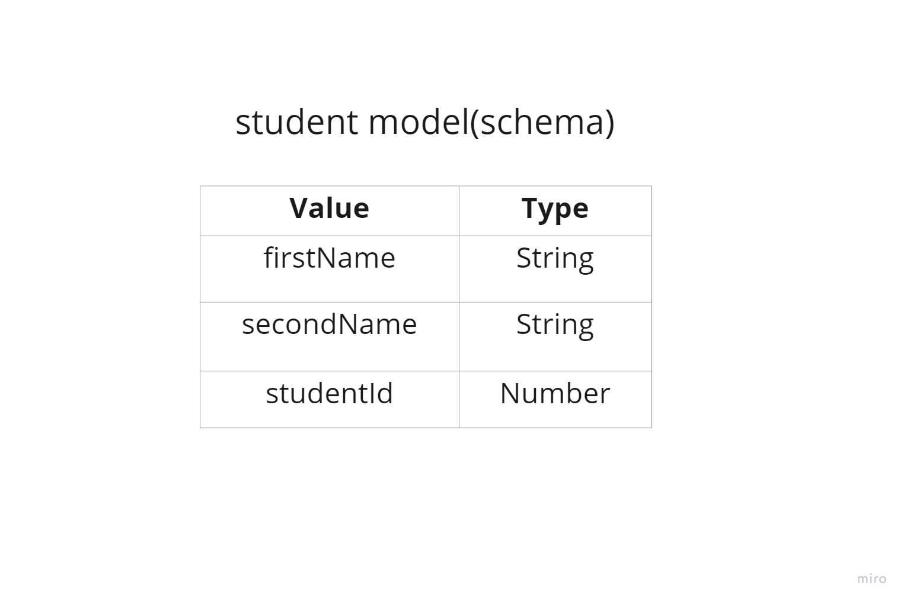

# CRUD-API

We will be building Simple CRUD(CREATE,READ,UPDATE,DELETE) operations using MERN(MongoDB,Expressjs,Reactjs,Nodejs) stack

`Let's Go`

- Initialize the `npm` in the project by executing the command `npm init -y` in the terminal. It will generate the `package.json` file in our current folder

- Install the `express` by executing the command `npm i express` `Expressjs` is the `Nodejs` framework used build the APIs

- Install the `mongoose` by executing the command `npm i mongoose`
  Mongoose is a JavaScript object-oriented programing library that creates the connection between the MongoDB and Nodejs javascript runtime environment.

- In this project i am using `MongoDB Atlas` to connect to online databse we need to use connection URL. So we will be pushing this code to Gitgub we can't push all the passwords and for that we install `dotenv` package from `npmjs` like so `npm i dotenv`.And also create the `.env` file in your current project folder.

- Also install `nodemon` to Refresh the server automatically when we make changes in our code instead of manually restarting the server we can do it like so `npm i -D nodemon`.

- Create a file called `app.js` in this file we will be writing the connection to DB and other main logic.

- In this project let's take the example of students and build the api around that like creating the student info ,Reading the student info, Updating the student info, Deleting the student info.

## CREATE

**HTTP Request Method** :`router.post('route',controllerLogic)`

To store the student information inside the database we need to create model(schema) for it like below. I created the simple schema with only 3 inputs



To make entry into the database we need to included below mentioned commands

```javascript
const newSomeName = new Model(req.body);
const newSavedData = newSomeName.save();
```

## READ

**HTTP Request Method** :`router.get('route',controllerLogic)`

To read from the database we need to use the below command

```javascript
const returedValue = Model.find();
```

To read the

## UPDATE

**HTTP Request Method** :`router.put('route',controllerLogic)`

we can use the below method from `mongoose` to find and update

**Model.findByIdAndUpdate()**

findByIdAndUpdate(id, update, options, callback)

In the above function

id:This can be Object({}),Number,String

update:It is the update values those we want to pass this is going to be an object{} for example most of the time we give `req.body`
that is an object

callback: It is an function callback function like so

```javascript
function(err, doc) {
    if (err) return res.send(500, {error: err});
    return res.send('Succesfully saved.');
}
```

Issues a mongodb findAndModify update command by a document's \_id field. findByIdAndUpdate(id, ...) is equivalent to findOneAndUpdate({ \_id: id }, ...).

## DELETE

**HTTP Request Method** :`router.delete('route',controllerLogic)`

We can use the below method from `mongoose` to delete the entry of student from database collection

**Model.findByIdAndRemove()**

`findByIdAndRemove(id, options, callback)`

In the above method `id` is the value `_id` to Query by

And `callback` function is similar

```javascript
function(err, doc) {
    if (err) return res.send(500, {error: err});
    return res.send('Succesfully saved.');
}
```

## PATCH

**HTTP Request Method** : `router.patch('route',controllerLogic)`

This is used to update only specific fields in the document

We can use the below mentioned `mongoose` methods to query the database

```javascript

```

## READ One Document

**HTTP Request Method** : `router.get('route',controllerLogic)`

To get the perticular Student fro the database we need to use the below mentioned commands.

```javascript
const oneDataDocument = MOdel.findById(id);
res.status(200).json(oneDataDocument);
```
